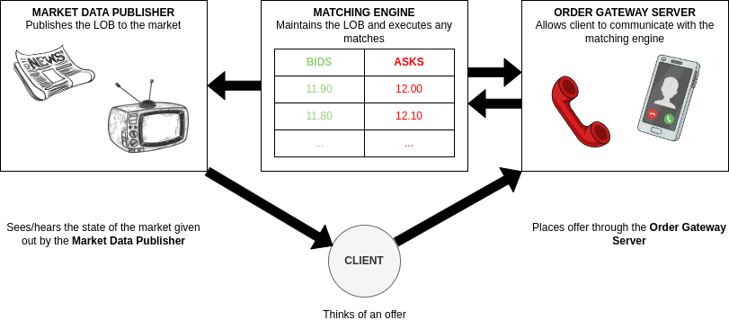
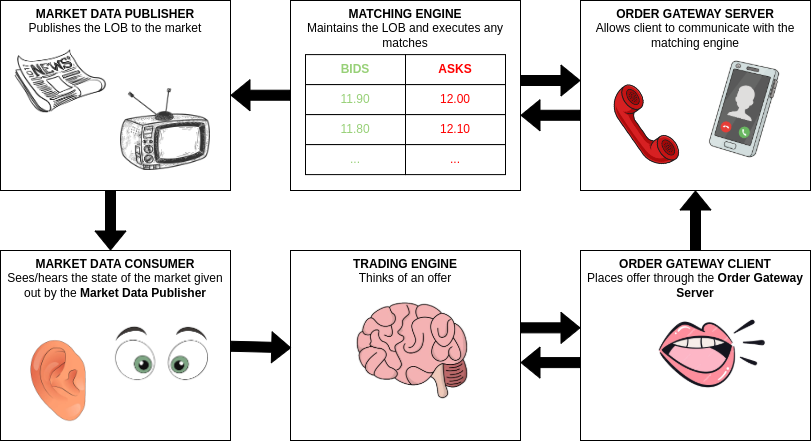

# Introduction to the Limit Order Book
When you wish to trade, first things first, you wish to (1) buy/sell (2) certain quantity (3) of a specific type of asset (4) either immediately at the best price or at a specified price, if and when possible. Now, you go to the exchange market. This is the place where everyone who wishes to trade go to; to (1) buy/sell (2) certain quantity (3) of a specific type of asset (4) either immediately at the best price or at a specified price, if and when possible. Orders to trade immediately are called **market orders**, while orders that are willing to wait until the desired price is reached (if ever) are called **limit orders**. Limit orders are keep inside the **limit order book**, which we shall describe below with an example. 

Albert collects what everyone wants to trade and organises the trading requests as follows:
1. Traders of the same type of asset are put together (if you are trading apples, you don't wanna hear or discuss about trading pinapples).
2. Within everyone wishing to trade the same type of asset, they get split between the ones who wish to buy and the ones who wish to sell.
3. Now, within everyone wishing to buy apples, we arrange them from those who are willing to pay the highest price, to the one who are willing to pay the lowest. Within everyone wishing to sell apples, we arrange them from those who are willing to sell at the lowest price, to the ones who are willing to sell at the highest price.
4. Sometimes, Albert will find two people who are willing to buy apples at the same price, or two people who are willing to sell apples at the same price. For the sake of fairness, Albert will arrange the trading requests, for both buying and selling, from the earliest to the latest.

This is the table he has for those wishing to trade apples. On the left, there is the ones wishing to buy, and on the right, the ones wishing to sell. 

Consider the following table:  

Time      |  Client | Quantity   | Price  | Price  | Quantity  | Client | Time
----------|---------|------------|--------|--------|-----------|--------|--------
04/12/2024|  Anna   | 1          | 2.05   | 0.65   |  3        | Robert |22/11/2024
05/12/2024|  Maria  | 20         | 1.75   | 1.05   |  8        | Kim    |14/10/2024
24/11/2024|  Edward | 2          | 0.65   | 1.75   |  22       | Luke   |12/01/2025

Robert is willing to sell 3 apples at the price of 0.65 each, Anna is willing to buy 1 apple at the price of 2.05, and Maria is willing to buy 20 apples at the maximum price of 1.75.

(a) Robert could sell his 3 apples, one at the price of 2.05; and the other 2 at the price of 1.75; or
(b) Anna could buy 1 apple from Robert at the price of 0.65; and Maria buy 2 apples from Robert at the price of 0.65.

This is where the timing of the passive orders becomes important. New orders trade against old orders. Because Anna and Maria placed their order request after Robert, Anna and Maria make the profit.

If the table was instead like this:

Time      |  Client | Quantity   | Price  | Price  | Quantity  | Client | Time
----------|---------|------------|--------|--------|-----------|--------|--------
04/12/2024|  Anna   | 1          | 2.05   | 0.65   |  3        | Robert |22/11/2024
05/11/2024|  Maria  | 20         | 1.75   | 1.05   |  8        | Kim    |14/10/2024
24/11/2024|  Edward | 2          | 0.65   | 1.75   |  22       | Luke   |12/01/2025

then Anna would buy 1 apple from Robert at the price of 0.65; while Robert would sell 2 apples at the price of 1.75 to Maria.

The executions would leave the following table:

Time      |  Client | Quantity   | Price  | Price  | Quantity  | Client | Time
----------|---------|------------|--------|--------|-----------|--------|--------
05/11/2024|  Maria  | 18         | 1.75   | 1.05   |  8        | Kim    |14/10/2024
24/11/2024|  Edward | 2          | 0.65   | 1.75   |  22       | Luke   |12/01/2025

Continuing with the above table, now, Maria can sell 8 apples to Kim at the price of 1.05 (Maria placed her order after Kim), and Luke can buy 10 apples from Maria at the price of 1.75 (Luke placed his order after Maria), leaving the following table:

Time      |  Client | Quantity   | Price  | Price  | Quantity  | Client | Time
----------|---------|------------|--------|--------|-----------|--------|--------
24/11/2024|  Edward | 2          | 0.65   | 1.75   |  12       | Luke   |12/01/2025

Because Edward is not willing to pay more than 0.65 per apple, and Luke is not willing to sell for lower than 1.75 per apple. The limit order book stays still until new orders come to enable executions.

# Introduction to the Digital Trading Environment

Before, exchange market may have been run like this: A lot of people queueing in front of Albert to put up their offers into the limit order book, according to the existing limit order book; then letting Albert do the appropiate matching. 

As the amount of people in the exchange grew, probably Albert started hiring more staff to help him out with the trading offers (making the exchange team or Albert's team). As time passed, maybe some people did not want to spend their time in the exchange and instead they would hire another person to go there, look at the limit order book and decide the trading offers for them (e.g., a broker). 

Maybe, as technology evolved, another alternative type of exchange was introduced. This one would have a machine (see the **exchange engine**) instead of a people's exchange team or Albert's team, dealing with the matchings. Maybe too, in this new trading environment, traders themselves could see the limit order book from their houses (through the TV or eventually the laptop - see the **market data publisher**), and be able to send their trading requests (through the phone, or eventually online - see the **order gateway server**): 

Perhaps, just as it happened in the physical exchange, the traders would rather choose a machine (see the **trading engine**) to make the trading offers for them according to the existing limit order book:

 